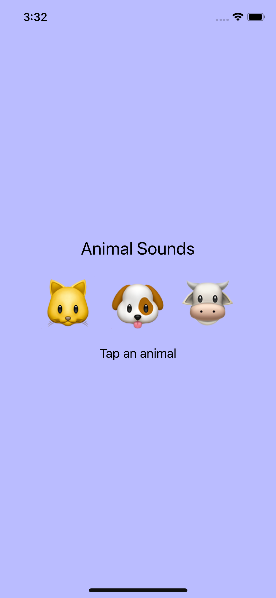
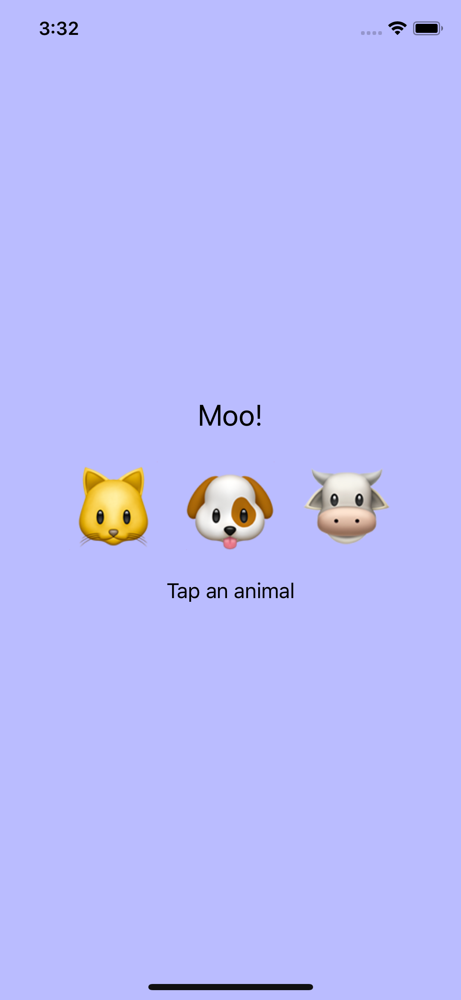
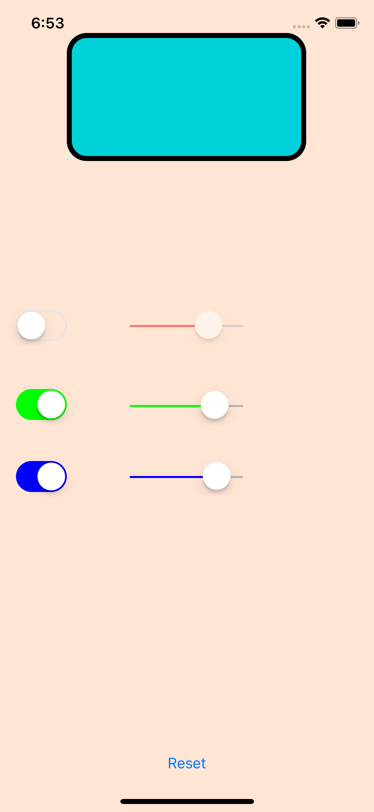
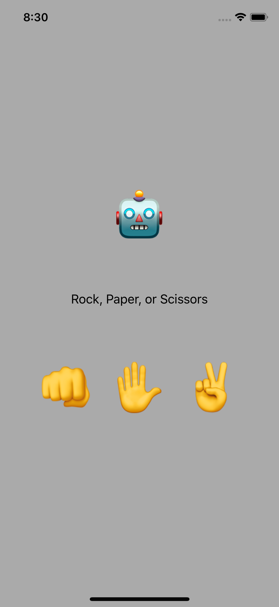
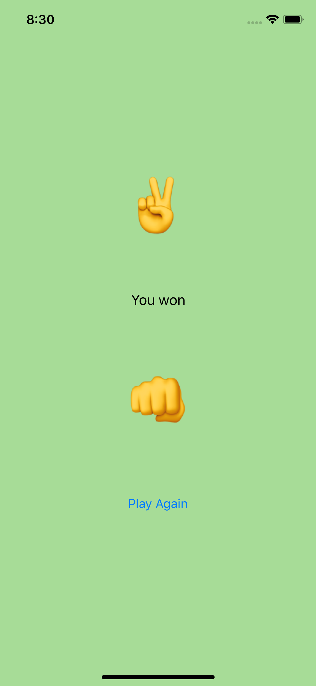
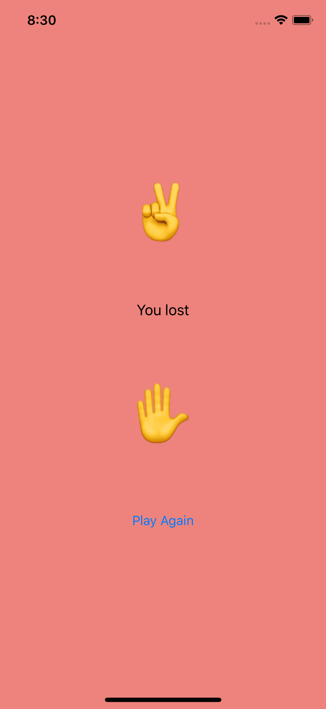
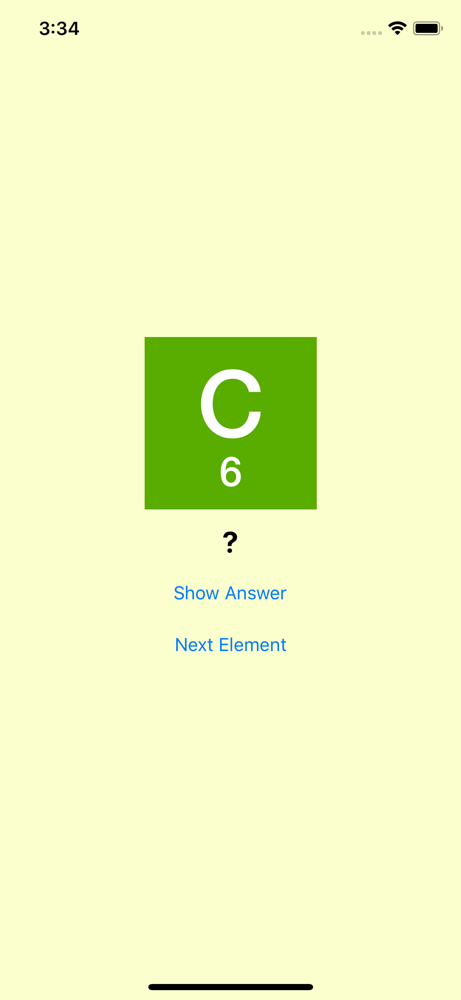
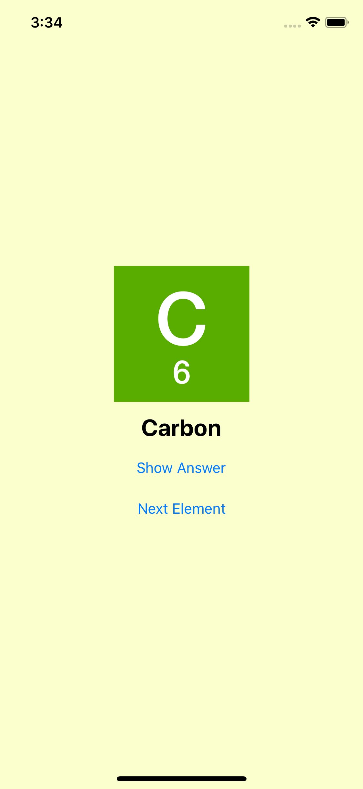
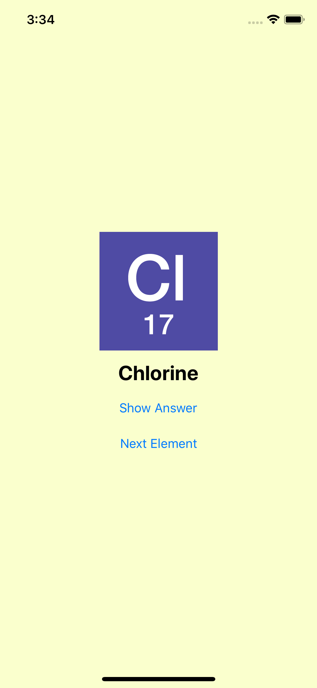

# Animal Sounds

``` diff
Description
```

3 buttons (with icons): cat, dog, and cow
3 sounds: for cat, dog, and cow

click on a button (icon) will make a different sound and text for the animal

 => interaction:  


# Color Picker

``` diff
Description
```

3 switches: red, green, blue

3 sliders: red, green, blue
(Converted to CGFloat to change to colors)

A Reset Button that resets the color, and disable the outlets


 => interaction:  


# Food Tracker

``` diff
Description
```

A food tracker that helps  keep track of meals everytime you find a tasty one
The user can add more meals, along with a picture and rating
Features:
- Adding a new meal
- Choosing a picture from the local library
- The user then can edit the meal, like changing the name, picture or rating
- If the user changes his mind, the meals are always deletable


# Meme Maker

``` diff
Description
```

# Rock Paper Scissors

``` diff
Description
```

The user plays Rock Paper Scissors agains a bot
3 buttons: 3 options for the user's turn
The bot then reacts with a random option.

Result:
When the user wins, the background turns GREEN
              loses, the background turns RED
When the game is a tie, it is in light GRAY

 => interaction:  


# Simple Adaptive UI

``` diff
Description
```

A simple element quiz
2 buttons:
'Show Answer' will show the answer
'Next Element' will move to the next question (change the icon + question + answer)

 => interaction:  


# Simple Quiz App

``` diff
Description
```


A simple element quiz
2 buttons:
'Show Answer' will show the answer
'Next Element' will move to the next question (change the icon + question + answer)
using ANIMATION for question label


